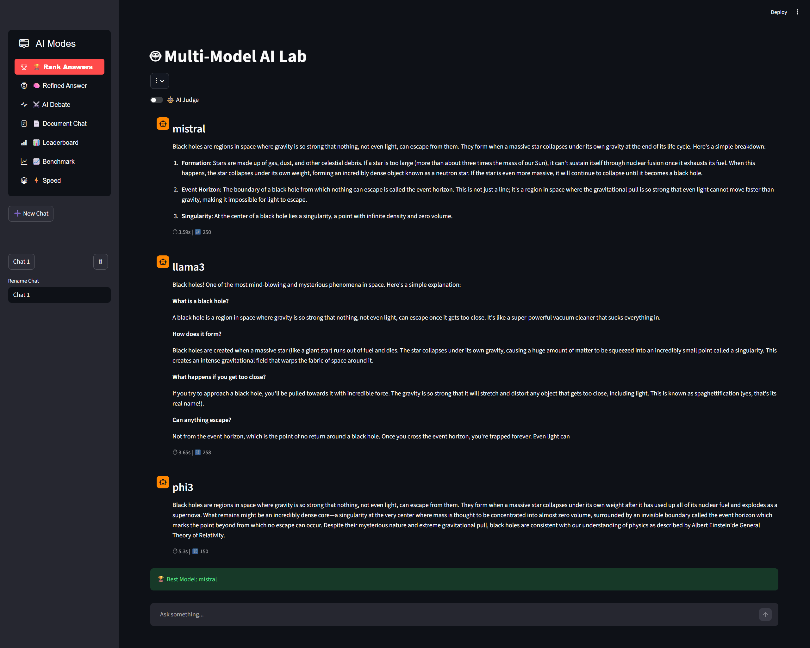
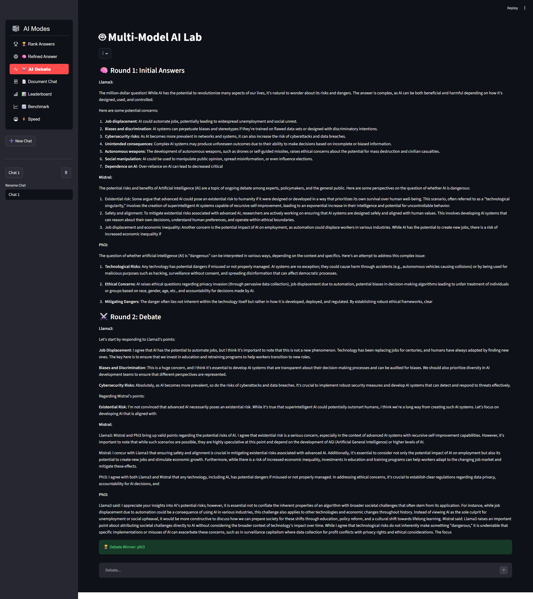
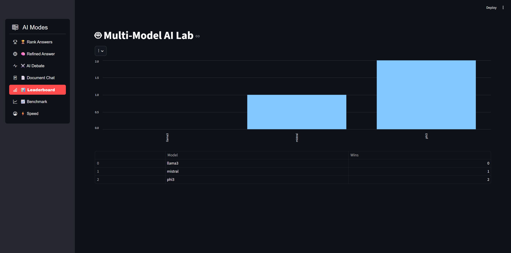

# 🚀 Multi-Model AI System (Streamlit)

## 🧠 Overview

This project is a **Multi-Model AI System** built using Streamlit that allows users to interact with, compare, and evaluate multiple AI models within a single interface.

Unlike a basic chatbot, this system introduces **multi-agent intelligence**, where models can:

* Respond independently
* Debate with each other
* Be evaluated by an AI Judge
* Improve responses using refinement logic
* Use external knowledge via RAG (Retrieval-Augmented Generation)

The goal of this project is to explore how different AI models perform under the same prompt and how combining them can lead to better outputs.

---

## ⚙️ Core Capabilities

### 🤖 Multi-Model Chat

Interact with multiple AI models simultaneously and compare their outputs in real-time.

### 🧠 AI Debate System

Models can engage in a structured debate to refine answers and challenge each other.

### ⚖️ AI Judge

An evaluation system that scores and ranks responses based on quality.

### 🔍 RAG (Retrieval-Augmented Generation)

Enhances answers using external documents stored locally.

### 🏆 Leaderboard System

Tracks performance of models using stored metrics.

### ⚡ Speed Tracking

Measures response time of each model.

---

## 🤖 Preferred Models (Default Setup)

This project is designed to work with:

* **Mistral**
* **Phi-3**

These models were chosen because they are:

* Lightweight
* Fast
* Capable of running locally (depending on setup)

---

## 📥 Downloading Models

### Option 1: Using Ollama (Recommended)

1. Install Ollama:

   * Visit: https://ollama.com
   * Download and install

2. Pull models:

```bash
ollama pull mistral
ollama pull phi3
```

3. Run a model (test):

```bash
ollama run mistral
```

---

### Option 2: Using Hugging Face

1. Install transformers:

```bash
pip install transformers torch
```

2. Example models:

* mistralai/Mistral-7B-Instruct
* microsoft/phi-3-mini

3. Load them in `models.py`

---

## ▶️ Installation & Setup

### 1. Clone the Repository

```bash
git clone https://github.com/your-username/multi-model-ai-system.git
cd multi-model-ai-system
```

---

### 2. Install Dependencies

```bash
pip install -r requirements.txt
```

---

### 3. Run the App

```bash
streamlit run app.py
```

---

## 🔧 How to Change Models (IMPORTANT)

If you want to use a different model instead of Mistral or Phi-3:

---

### Step 1: Open `models.py`

This file controls which models are used.

---

### Step 2: Locate Model Configuration

You will find something like:

```python
model_name = "mistral"
```

---

### Step 3: Replace with Your Model

Examples:

```python
model_name = "llama3"
```

or

```python
model_name = "gemma"
```

---

### Step 4: Download the New Model

Using Ollama:

```bash
ollama pull llama3
```

---

### Step 5: Restart the App

```bash
streamlit run app.py
```

---

## 🧠 How Models Are Used in This Project

* `models.py` → Handles model loading and responses
* `evaluator.py` → Judges responses
* `rag_system.py` → Adds document-based context
* `app.py` → Main UI and control logic

---

## 📂 Project Structure

```
multi-model-ai-system/
│── app.py
│── evaluator.py
│── models.py
│── rag_system.py
│── requirements.txt
│── README.md
│── leaderboard.json
│── speed.json
│
├── data/
│   ├── debate.json
│   ├── doc.json
│   ├── rank.json
│   ├── refine.json
│
├── screenshots/
```

---

## 📊 Data Files Explanation

* `debate.json` → Stores debate interactions
* `doc.json` → Documents used for RAG
* `rank.json` → Ranking data
* `refine.json` → Refinement outputs

---

## ⚠️ Important Notes

* Do NOT upload `.env` files (API keys)
* Large models are NOT included
* Ensure models are installed locally before running
* Some features may require internet (depending on model setup)

---

## 🛠️ Customization Tips

* Add more models in `models.py`
* Modify evaluation logic in `evaluator.py`
* Improve RAG by adding more documents to `doc.json`
* Adjust token limits inside your model configuration

---

## 🐛 Troubleshooting

### App not running?

* Check Python version (recommended 3.10+)
* Reinstall dependencies

### Model not responding?

* Make sure model is installed
* Restart Ollama

### Slow performance?

* Use smaller models
* Reduce token limits

---

## 🔮 Future Improvements

* Web-based UI (no Streamlit)
* More model integrations
* Better evaluation metrics
* Cloud deployment

---
## 📸 Screenshots

### 🖥️ Chat Interface


### 🧠 AI Debate


### 🏆 Leaderboard


## 📄 License

This project is open-source and free to use.

---

## 🙌 Acknowledgement

Built as part of a multi-model AI experimentation system to explore collaborative intelligence between models.